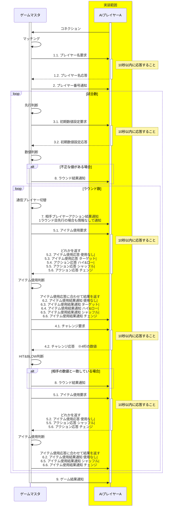

```mermaid
sequenceDiagram
participant gm as ゲームマスタ
box yellow 実装範囲
    participant ai as AIプレイヤーA
end

activate gm
activate ai
ai ->> gm:コネクション
gm ->> gm:マッチング


gm ->>+ ai:1.1. プレイヤー名要求
    note right of ai: 10秒以内に応答すること
ai -->>- gm:1.2. プレイヤー名応答

gm ->> ai:2. プレイヤー番号通知

loop 試合数
    gm ->> gm:先行判断
    gm ->>+ ai:3.1. 初期数値設定要求
        note right of ai: 10秒以内に応答すること
    ai -->>- gm:3.2. 初期数値設定応答
    gm ->> gm:数値判断
    alt 不正な値がある場合
        gm ->> ai:8. ラウンド結果通知
    end

    loop ラウンド数
        gm ->> gm:通信プレイヤー切替
        gm ->> ai:7. 相手プレイヤーアクション結果通知<br>1ラウンド目先行の場合も情報なしで通知
        gm ->>+ ai:5.1. アイテム使用要求
            note right of ai: 10秒以内に応答すること
        ai -->>- gm:どれかを返す<br>5.2. アイテム使用応答 使用なし|<br>5.3. アイテム使用応答 ターゲット|<br>5.4. アクション応答 ハイ&ロー|<br>5.5. アクション応答 シャッフル|<br>5.6. アクション応答 チェンジ

        gm ->> gm:アイテム使用判断
        gm ->> ai:アイテム使用応答に合わせて結果を返す<br>6.2. アイテム使用結果通知 使用なし|<br>6.3. アイテム使用結果通知 ターゲット|<br>6.4. アイテム使用結果通知 ハイ&ロー|<br>6.5. アイテム使用結果通知 シャッフル|<br>6.6. アイテム使用結果通知 チェンジ
        
        
        gm ->>+ ai:4.1. チャレンジ要求
            note right of ai: 10秒以内に応答すること
        ai -->>- gm:4.2. チャレンジ応答　※4桁の数値
        gm ->> gm:HIT&BLOW判断

        alt 相手の数値と一致している場合
            gm ->> ai:8. ラウンド結果通知
        end


        gm ->>+ ai:5.1. アイテム使用要求
            note right of ai: 10秒以内に応答すること
        ai -->>- gm:どれかを返す<br>5.2. アイテム使用応答 使用なし|<br>5.5. アクション応答 シャッフル|<br>5.6. アクション応答 チェンジ

        gm ->> gm:アイテム使用判断
        gm ->> ai:アイテム使用応答に合わせて結果を返す<br>6.2. アイテム使用結果通知 使用なし|<br>6.5. アイテム使用結果通知 シャッフル|<br>6.6. アイテム使用結果通知 チェンジ
    end
end
gm ->> ai:9. ゲーム結果通知

deactivate gm
deactivate ai

```